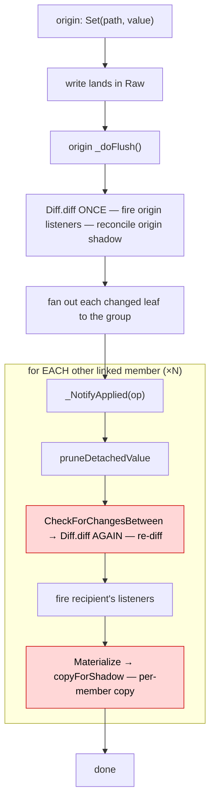
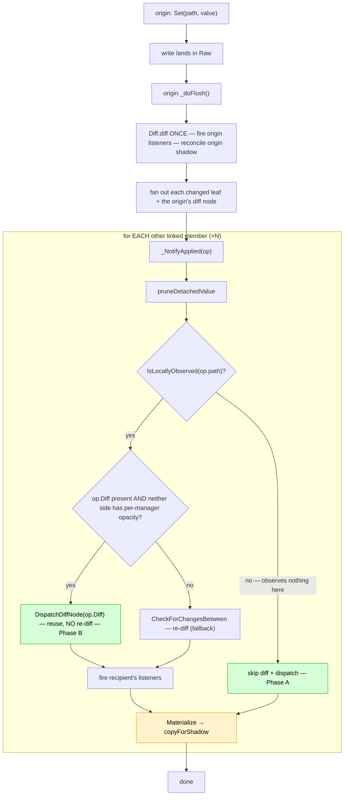

# Linked Fan-Out Optimization

How a write on one member of a `LinkGroup` is replayed to the other members,
**before** and **after** the fan-out optimization (2026-06-20).

## Goal

A write to a region shared by N linked managers should cost **one diff,
regardless of N** — the origin already diffed it; recipients should not
re-diff what was already diffed. Dispatch (firing each observing member's own
listeners) is inherently per-observer and cannot be reduced; the per-member
shadow copy is addressed only by the deferred Phase C below.

## Current behavior (before optimization)

Every recipient independently re-runs `Diff.diff` and re-copies the changed
subtree into its own shadow — even recipients that observe nothing at that path.

## New behavior (Phase A + B, implemented)

- **Phase A** — a recipient that observes nothing locally at `op.Path`
  (`Coverage.IsLocallyObserved`) skips the diff + dispatch entirely; no listener
  or signal of its own would fire anyway. Its shadow is still `Materialize`d so a
  write **it** later originates fans out a correct `oldValue`.
- **Phase B** — an observing recipient replays the origin's already-built diff
  node (`ChangeDetector:DispatchDiffNode`) instead of re-diffing, when neither
  side has per-manager opacity marks (see "Opacity gate"). Otherwise it falls
  back to today's `CheckForChangesBetween`.

## Cost per write to a region shared by N members

| | `Diff.diff` calls | Dispatch (fire listeners) | Shadow copies |
|---|---|---|---|
| **Current** | 1 + N (re-diff each recipient) | N (incl. members observing nothing) | N |
| **New (A + B)** | **1** (origin only) | observers only | N |
| **+ Phase C** *(deferred)* | 1 | observers | **1** (group-owned shadow) |

The yellow `Materialize` node is the only remaining per-member cost; collapsing
it to one is what **Phase C** would do.

## Opacity gate (Phase B)

Reuse is safe iff the origin's diff tree equals what the recipient would compute.
That holds when **neither side has per-manager opaque marks**
(`self._opaqueRegistries.Count == 0` on both). **Global** opacity is shared by
every manager, so it shapes the origin's and the recipient's diff *identically*
and is safe to reuse across — which is why the gate keys on the per-manager
registry count, **not** `GetOpaqueCtx()` (the latter also reflects the
session-wide global count and would needlessly disable reuse). The flag rides on
the fan-out op as `OriginHasNoOpacity`; the recipient re-checks its own count.

## Correctness invariants preserved

- A recipient's shadow stays current even when Phase A skips its dispatch
  (`Materialize` is never skipped), so writes it later originates fan out the
  right `oldValue`.
- Phase B is byte-identical to the re-diff path when the gate holds:
  `op.Diff` equals `Diff.diff(op.OldValue, op.NewValue)` under matching opacity,
  so `DispatchDiffNode` emits the same events — only the recomputation is removed.
- Array fan-out (`ArrayInsert/Remove/Set`) is unchanged.

## Implementing code

- `Coverage.luau` — `IsLocallyObserved` (signals + `CoversChangesAt`, no
  link-group clause); `IsTrackable` delegates to it.
- `TableManager.luau` — `_NotifyApplied` Set branch (Phase A skip + Phase B
  reuse/fallback).
- `ChangeDetector.luau` — `DispatchDiffNode` + the shared `_emitRootNode` tail.
- `LinkGroup.luau` / `Emitter.luau` — thread the origin's diff node +
  `OriginHasNoOpacity` through `FanOutSet` → `NotifyChange` → the applied op.
- `TMTypes.luau` — `Diff` / `OriginHasNoOpacity` on `RelativeOp` / `AppliedOp`.
- Tests: `Tests/TM/TableManager.link-fanout-perf.spec.luau`.

## Phase C (deferred) — group-owned shadow

The remaining per-member `Materialize` (one shadow copy per member per write) is
eliminated only by the `LinkGroup` owning **one** shadow for the shared region,
with members delegating shadow access (coordinate-translated) and the origin
reconciling it once. Safe in principle under single-owner semantics (no private
per-member copies ⇒ no aliasing) plus an "ask who cares" walk-depth rule for
asymmetric opacity, but a large change (delegation router, group-shadow lifecycle
across link/unlink/divergence, copy-on-leave). Not yet built.

## Related: coalesced flushing (Part 1)

A separate axis, `Config.FlushMode = "coalesced"` (`CoalescedFlush.luau`), defers
a write's `_doFlush` to frame-end and merges all flush requests into one
common-ancestor root — one diff/one firing per path per frame instead of per
write. Orthogonal to the fan-out optimization above.
